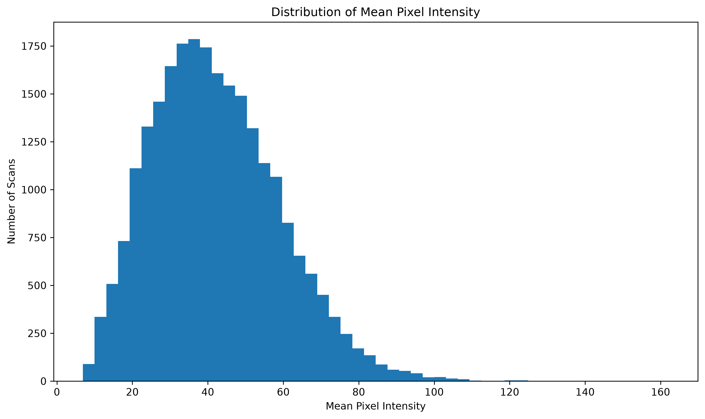
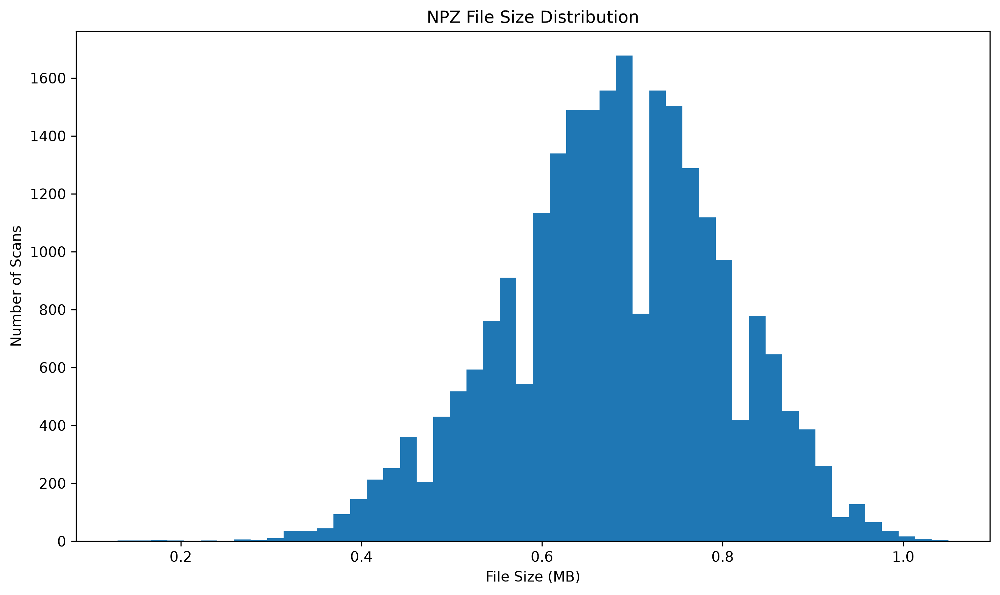
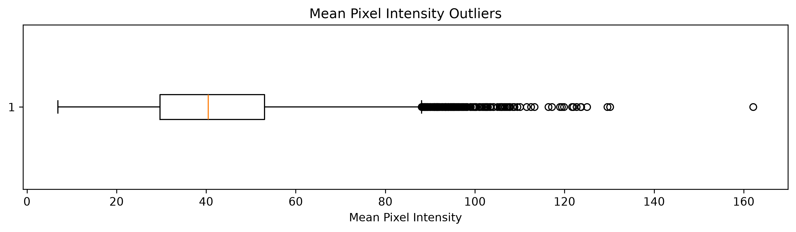

## Repository Structure

```text
medical-image-quality-analysis/
├── images/
│   ├── intensity_distribution.png
│   ├── file_size_distribution.png
│   └── intensity_boxplot.png
├── notebooks/
│   └── dataset_analysis.ipynb
├── reports/
│   ├── dataset_report.csv
│   └── possible_outliers.csv
├── .gitignore
├── README.md
└── requirements.txt
```

## Visualizations

### Mean Pixel Intensity Distribution



### File Size Distribution



### Intensity Outliers


